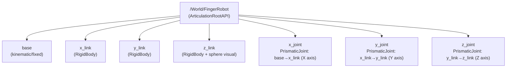

Let me explore your workspace and the referenced tutorials to find the best approach for adding a prismatic-joint-actuated sphere.

Read [](file:///home/xiao/isaacsim/standalone_examples/api)

Read memory [](file:///home/xiao/.config/Code/User/workspaceStorage/a2f87fbd2ec2edaa890807f5af942614/GitHub.copilot-chat/memory-tool/memories/repo/isaacsim_notes.md)

Read [](file:///home/xiao/isaacsim/standalone_examples/api/isaacsim.core.experimental.actuators)

Read [](file:///home/xiao/isaacsim/standalone_examples/api/isaacsim.core.experimental.api)

Read [](file:///home/xiao/isaacsim/standalone_examples/api/isaacsim.core.experimental.actuators/newton_actuators_python_example.py)

Read [](file:///home/xiao/isaacsim/standalone_examples/api/isaacsim.core.experimental.api/add_cubes.py)

Read [](file:///home/xiao/isaacsim/standalone_examples/api/isaacsim.core.experimental.api/control_robot_numpy.py)

Read [](file:///home/xiao/isaacsim/standalone_examples/api/isaacsim.core.experimental.actuators/newton_actuators_python_example.py)

Read [](file:///home/xiao/isaacsim/standalone_examples/api/isaacsim.core.experimental.api/control_robot_numpy.py)

Read [](file:///home/xiao/isaacsim/standalone_examples/api/isaacsim.asset.importer.urdf)

Searched for text `prismatic` (`/home/xiao/isaacsim/standalone_examples/api/**`), no results

Read [](file:///home/xiao/isaacsim/standalone_examples/api/isaacsim.asset.importer.urdf/urdf_import.py)

Read [](file:///home/xiao/0_codes/poke_map/env/actuator_setup.py#1-1), lines 1 to 120

Read [](file:///home/xiao/0_codes/poke_map/env/scene_setup.py#1-1), lines 1 to 60

Searched for regex `PrismaticJoint|PhysicsJoint|create_joint|add_joint` (`/home/xiao/isaacsim/standalone_examples/api/**`), no results

Read [](file:///home/xiao/0_codes/poke_map/env/add_panda.py)

Read [](file:///home/xiao/0_codes/poke_map)

Searched for regex `from pxr import.*UsdPhysics|import.*UsdPhysics` (`/home/xiao/isaacsim/**`), no results

Searched for regex `UsdPhysics|PrismaticJoint|ArticulationRoot` (`poke_map`), no results

Read [](file:///home/xiao/isaacsim/standalone_examples/api/isaacsim.core.experimental.actuators/newton_actuators_python_example.py)

Read [](file:///home/xiao/isaacsim/standalone_examples/api/isaacsim.core.experimental.actuators/newton_actuators_usd_example.py)

Read [](file:///home/xiao/isaacsim/standalone_examples/api/isaacsim.core.experimental.actuators/newton_actuators_omnigraph_example.py)

Now I have a thorough understanding of the Isaac Sim patterns. Let me build the add_finger_robot.py with a proper 3-DOF prismatic finger robot using the experimental API patterns.

Created 4 todos

Created [](file:///home/xiao/0_codes/poke_map/add_finger_robot.py)

Starting: *Refine to integrate with existing scene_setup stage* (4/4)

Created [](file:///home/xiao/0_codes/poke_map/add_finger_robot.py)

Read [](file:///home/xiao/0_codes/poke_map/add_finger_robot.py#1-1), lines 1 to 5

Read [](file:///home/xiao/0_codes/poke_map/add_finger_robot.py#1-1), lines 1 to 300


```

```


Completed: *Refine to integrate with existing scene_setup stage* (4/4)

Read [](file:///home/xiao/0_codes/poke_map/add_finger_robot.py#1-1), lines 1 to 50

Here's a summary of what I built in add_finger_robot.py:

---

## Finger Robot Structure

The script builds a **3-DOF prismatic "finger" robot** as a USD articulation under `/World/FingerRobot`:



- **`base`** — kinematic (fixed) link anchored to the world
- **`x_link` → `y_link` → `z_link`** — dynamic links chained with prismatic joints
- **`z_link/sphere_visual`** — a red sphere (radius 2.5 cm) as the finger tip

## Key Design Decisions (from Isaac Sim tutorials)

| Pattern | Source tutorial |
|---|---|
| `Articulation(FINGER_ROOT_PATH)` to discover DOFs | control_robot_numpy.py |
| `ArticulationActuators.from_actuators()` with Newton `ControllerPD` | newton_actuators_python_example.py |
| `UsdPhysics.PrismaticJoint` + `ArticulationRootAPI` for custom articulation | newton_actuators_usd_example.py (USD authoring) |
| `clear_previous_handles()` + `globals().update()` for re-runnable scripts | `scene_setup_vectorized.py` |

## Usage Workflow

```python
# 1. Run scene_setup_vectorized.py (sets up envs, L-objects, cylinders)
# 2. Run add_finger_robot.py
# 3. Interactive control:
move_finger_to(finger_actuators, [0.1, -0.05, 0.08])  # absolute XYZ
get_tip_pose()                                           # world (pos, quat)
finger_articulation.get_dof_positions()                  # current joint state
```

The script is idempotent — re-running it safely clears old handles and rebuilds. It integrates with `scene_setup_vectorized.py`'s existing stage (doesn't create a new one if ground/light already exist).

Made changes.